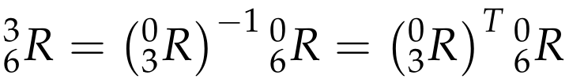

# **Kinematics Pick & Place**

[](https://www.udacity.com/robotics)

## Overview

**Steps to complete the project:**  

1. Set up your ROS Workspace.
2. Download or clone the [project repository](https://github.com/udacity/RoboND-Kinematics-Project) into the ***src*** directory of your ROS Workspace.  
3. Experiment with the forward_kinematics environment and get familiar with the robot.
4. Launch in [demo mode](https://classroom.udacity.com/nanodegrees/nd209/parts/7b2fd2d7-e181-401e-977a-6158c77bf816/modules/8855de3f-2897-46c3-a805-628b5ecf045b/lessons/91d017b1-4493-4522-ad52-04a74a01094c/concepts/ae64bb91-e8c4-44c9-adbe-798e8f688193).
5. Perform Kinematic Analysis for the robot following the [project rubric](https://review.udacity.com/#!/rubrics/972/view).
6. Fill in the `IK_server.py` with your Inverse Kinematics code.

## Project Details

### Kinematic Analysis
#### DH parameter table

<div></div>

To construct the DH parameter table, the following steps are performed.

* Label joints from 1 to n
* Define joint axis
* Label links for 0 to n
* Define common normals and reference frame origins
* Add gripper frame
* Label all non-zero DH parameters (link length a, link offset d, twist angle alpha, joint angle theta)

Using URDF file `kr210.urdf.xacro`, the DH parameter table is derived.

Links | alpha(i-1) | a(i-1) | d(i-1) | theta(i)
--- | --- | --- | --- | ---
0->1 | 0 | 0 | 0.75 | q1
1->2 | -pi/2 | 0.35 | 0 | -pi/2 + q2
2->3 | 0 | 1.25 | 0 | q3
3->4 | -pi/2 | -0.054 | 1.5 | q4
4->5 | pi/2 | 0 | 0 | q5
5->6 | -pi/2 | 0 | 0 | q6
6->EE | 0 | 0 | 0.303 | 0

#### DH Transformation matrices

Here is the code snippet for creating DH transformation matrices.

```python
# Create symbols
d1, d2, d3, d4, d5, d6, d7 = symbols('d1:8')
a0, a1, a2, a3, a4, a5, a6 = symbols('a0:7')
alpha0, alpha1, alpha2, alpha3, alpha4, alpha5, alpha6 = symbols('alpha0:7')
q1, q2, q3, q4, q5, q6, q7 = symbols('q1:8')

# Create Modified DH parameters
DH_Table = {alpha0:     0, a0:      0, d1:  0.75, q1:       q1,
            alpha1: -pi/2, a1:   0.35, d2:     0, q2: -pi/2+q2,
            alpha2:     0, a2:   1.25, d3:     0, q3:       q3,
            alpha3: -pi/2, a3: -0.054, d4:   1.5, q4:       q1,
            alpha4:  pi/2, a4:      0, d5:     0, q5:       q5,
            alpha5: -pi/2, a5:      0, d6:     0, q6:       q6,
            alpha6:     0, a6:      0, d7: 0.303, q7:        0}

# Define Modified DH Transformation matrix
def TF_Matrix(alpha, a, d, q):
    TF = Matrix([[            cos(q),           -sin(q),           0,             a],
                 [ sin(q)*cos(alpha), cos(q)*cos(alpha), -sin(alpha), -sin(alpha)*d],
                 [ sin(q)*sin(alpha), cos(q)*sin(alpha),  cos(alpha),  cos(alpha)*d],
                 [                 0,                 0,           0,             1]])
    return TF

# Create individual transformation matrices
T0_1 = TF_Matrix(alpha0, a0, d1, q1).subs(DH_Table)
T1_2 = TF_Matrix(alpha1, a1, d2, q2).subs(DH_Table)
T2_3 = TF_Matrix(alpha2, a2, d3, q3).subs(DH_Table)
T3_4 = TF_Matrix(alpha3, a3, d4, q4).subs(DH_Table)
T4_5 = TF_Matrix(alpha4, a4, d5, q5).subs(DH_Table)
T5_6 = TF_Matrix(alpha5, a5, d6, q6).subs(DH_Table)
T6_EE = TF_Matrix(alpha6, a6, d7, q7).subs(DH_Table)

T0_EE = T0_1 * T1_2 * T2_3 * T3_4 * T4_5 * T5_6 * T6_EE
```

The above code outputs the following matrices.

```
T0_1 = [[cos(q1), -sin(q1), 0,    0],
        [sin(q1),  cos(q1), 0,    0],
        [      0,        0, 1, 0.75],
        [      0,        0, 0,    1]]

T1_2 = [[sin(q2),  cos(q2), 0, 0.35],
        [      0,        0, 1,    0],
        [cos(q2), -sin(q2), 0,    0],
        [      0,        0, 0,    1]]

T2_3 = [[cos(q3), -sin(q3), 0,  1.25],
        [sin(q3),  cos(q3), 0,     0],
        [      0,        0, 1,     0],
        [      0,        0, 0,     1]]

T3_4 = [[ cos(q4), -sin(q4),  0, -0.054],
        [       0,        0,  1,    1.5],
        [-sin(q4), -cos(q4),  0,      0],  
        [       0,        0,  0,      1]]

T4_5 = [[cos(q5), -sin(q5),  0, 0],
        [      0,        0, -1, 0],
        [sin(q5),  cos(q5),  0, 0],
        [      0,        0,  0, 1]]

T5_6 = [[ cos(q6), -sin(q6), 0, 0],
        [       0,        0, 1, 0],
        [-sin(q6), -cos(q6), 0, 0],
        [       0,        0, 0, 1]]

T6_EE = [[1, 0, 0,     0],
         [0, 1, 0,     0],
         [0, 0, 1, 0.303],
         [0, 0, 0,     1]]

T0_EE = [[1, 0, 0, 2.153],
         [0, 1, 0,     0],
         [0, 0, 1, 1.946],
         [0, 0, 0,     1]]
```

#### Inverse Kinematics

Kuka KR210 would use the first three joints to control the position of the wrist center while the last three joints would orient the end effector as needed.

The following steps are performed for inverse kinematics.

* Find the location of the WC relative to the base frame (From the WC to the EE, this displacement is just a translation)

<div></div>
<div></div>

* Find joint variables, q1, q2 and q3

<div></div>
<div></div>

* Calculate R^3_0

* Find a set of Euler angles corresponding to the rotation matrix

<div></div>

* Choose the correct solution among the set of possible solutions

Here is the code snippet for inverse kinematics.

```python
# Calculate joint angles using Geometric IK method
theta1 = atan2(WC[1], WC[0])

side_a = 1.501
side_b = sqrt(pow(sqrt(WC[0] * WC[0] + WC[1] * WC[1]) - 0.35, 2) + pow((WC[2] - 0.75), 2))
side_c = 1.25

angle_a = acos((side_b * side_b + side_c * side_c - side_a * side_a) / (2 * side_b * side_c))
angle_b = acos((side_a * side_a + side_c * side_c - side_b * side_b) / (2 * side_a * side_c))
angle_c = acos((side_a * side_a + side_b * side_b - side_c * side_c) / (2 * side_a * side_b))

theta2 = pi/2 - angle_a - atan2(WC[2] - 0.75, sqrt(WC[0] * WC[0] + WC[1] * WC[1]) - 0.35)
theta3 = pi/2 - (angle_b + 0.036)

R0_3 = T0_1[0:3,0:3] * T1_2[0:3,0:3] * T2_3[0:3,0:3]
R0_3 = R0_3.evalf(subs={q1: theta1, q2: theta2, q3: theta3})

R3_6 = R0_3.inv("LU") * ROT_EE

theta4 = atan2(R3_6[2,2], -R3_6[0,2])
theta5 = atan2(sqrt(R3_6[0,2]*R3_6[0,2] + R3_6[2,2]*R3_6[2,2]), R3_6[1,2])
theta6 = atan2(-R3_6[1,1], R3_6[1,0])
```


### Result

Using the code I implemented, the robot tracked the planned trajectory and successfully completed pick and place operation.

Here is the screenshot of a successful pick and place trial.

<div></div>
